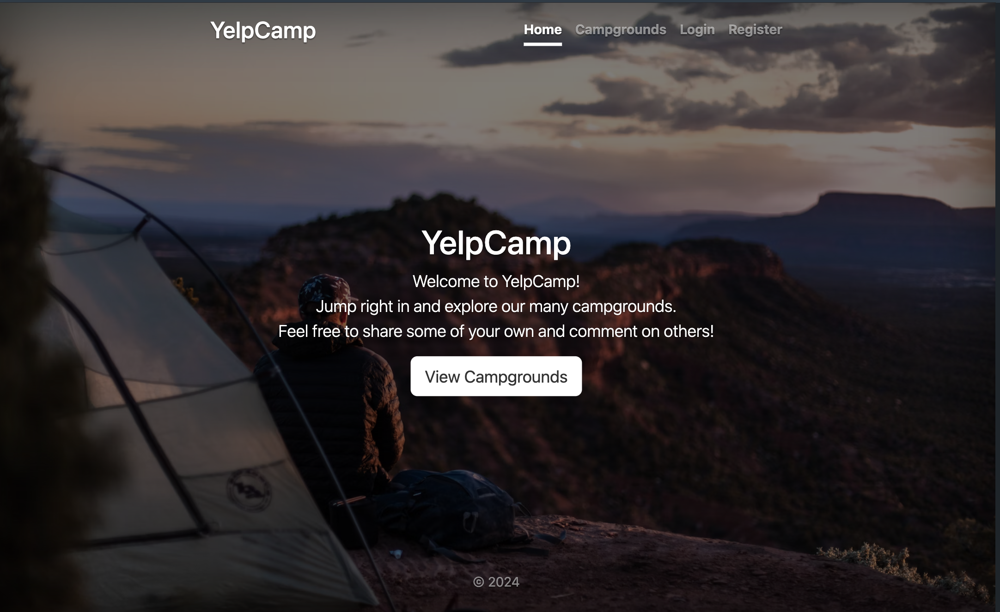
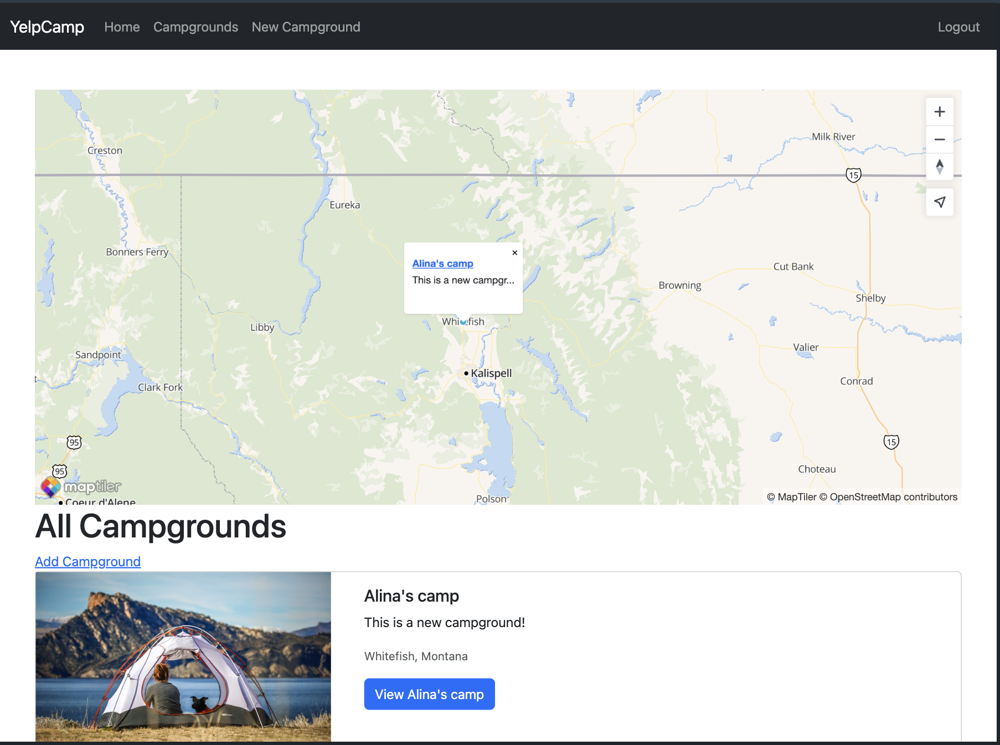
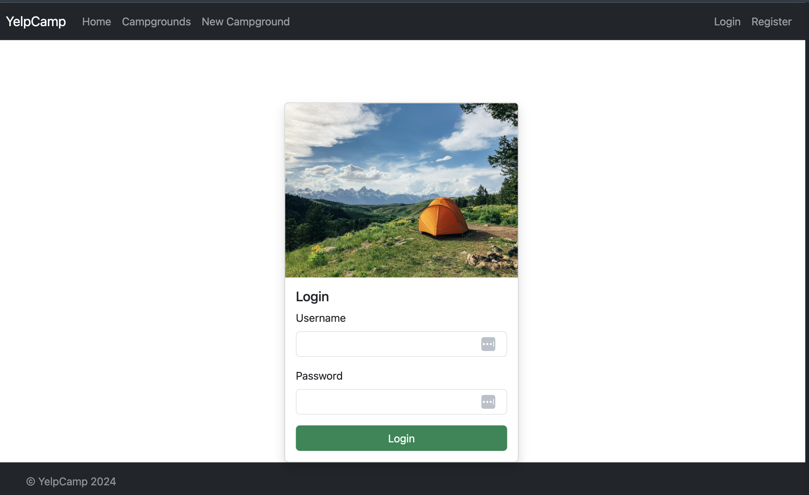
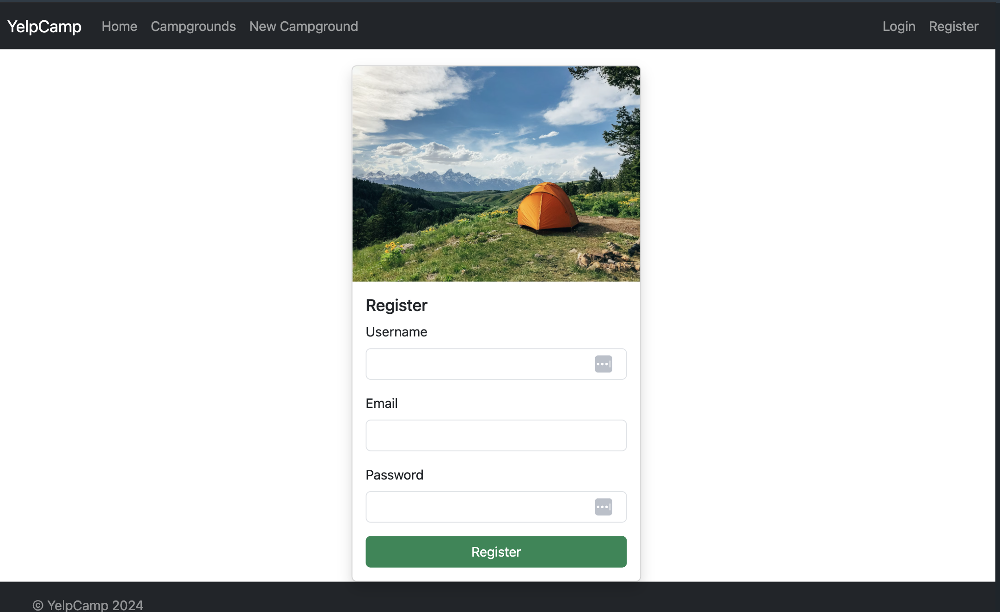
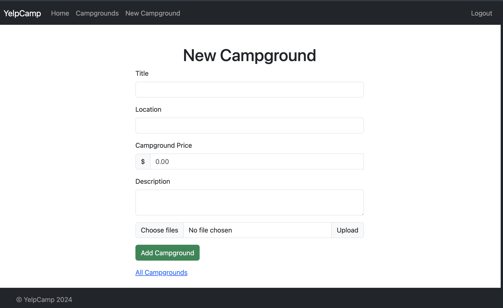
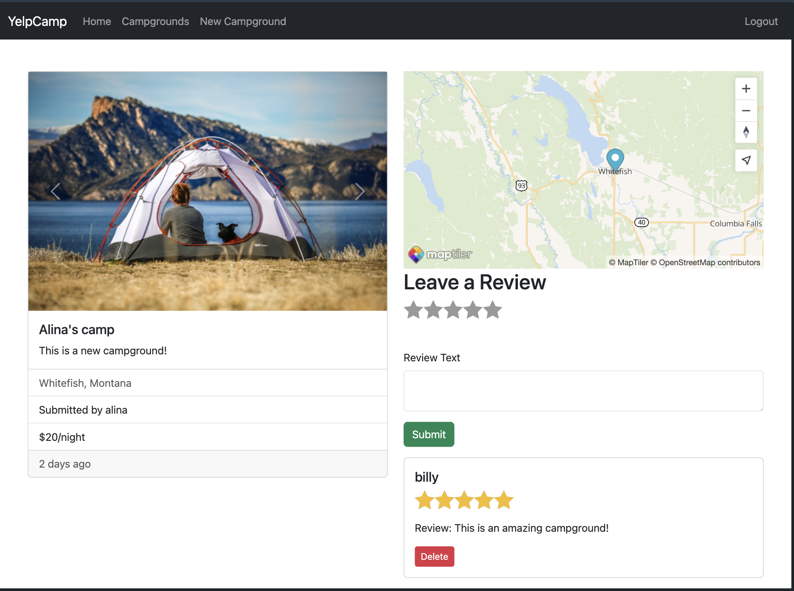

# Yelp Camp

## Table of contents

- [Overview](#overview)
  - [The challenge](#the-challenge)
  - [Screenshot](#screenshot)
  - [Links](#links)
- [My process](#my-process)
  - [Built with](#built-with)
  - [What I learned](#what-i-learned)
- [Author](#author)

## Overview

This project represents a fullstack web application where an user can create an account and register a new campground. Users can also rate and leave comments on different campgrounds.

### The challenge

Users should be able to:

- Create a new account
- Login to the account
- Create a new campground
- Rate campgrounds
- Review campgrounds
- Edit the campground that is owned by that user
- Delete the campground that is owned by that user
- Perform a search on the provided map
- Select a campground from the map
- See an error message when trying to submit data that is not valid

### Overview

#### Homepage

#### Show campgrounds page

#### Login page

#### Register page

#### Create a new campground page

#### Show one campground page

### Links

- Solution URL: [Solution URL here](https://github.com/AlinaAlexandraVizireanu/yelp-camp)
- Live Site URL: [Live site URL here](https://yelp-camp-st81.onrender.com)

## My process

I started this project which is part of the Web Developer Bootcamp by Colt Steele.
During this process of building this website by coding along with Colt, I learned how to build a CRUD application in Express using different packages.
In the first part, I implemented the routes and then I implemented the templates for the webpages.
To store the data I used MongoDB and for the front-end part, I used Bootstrap.
For deploying part I used Render.

### Built with

- Express
- MongoDB
- Bootstrap
- JavaScript
- EJS
- CSS
- Render

### What I learned

The process of building this web page was a bit challenging, but it helped me to consolidate my knowledges regarding a fullstack web application.

## Author

- Website - [YELP CAMP](https://yelp-camp-st81.onrender.com/campgrounds)
